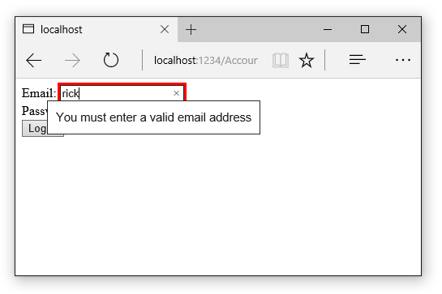
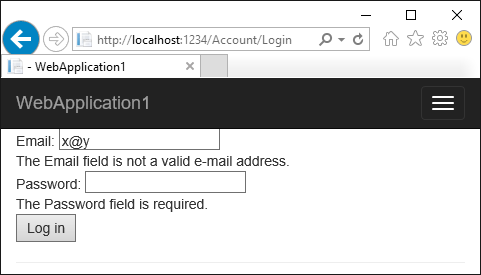
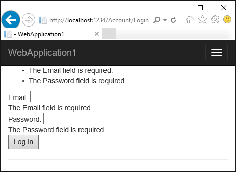

Working with Forms
============================

By `Rick Anderson`_  and `Dave Paquette <https://twitter.com/Dave_Paquette>`_

This document will demonstrate working with Forms and the HTML elements commonly used on a Form. The HTML Form element provides the primary mechanism web apps use to postback data to the server. Most of this document describes :doc:`Tag Helpers <tag-helpers/intro>` and how they can help you productively create robust HTML forms.

.. contents:: Sections:
  :local:
  :depth: 1

Pa$$w0rd

form, input**, text area, select+option, label, validation summary+message

The Form Tag Helper
---------------------
  
The `Form <https://www.w3.org/TR/html401/interact/forms.html>`__ Tag Helper generates the HTML ``action`` attribute value to a MVC controller action or named route. In the following code the ``action`` attribute value will be set to ``action="/Account/Login"``.

.. fix literalinclude:: forms/sample/Views/DemoRegistration/RegisterFormOnly.cshtml
  :language: HTML
  :linenos:
  :emphasize-lines: 3
  
The markup above is a simplified version of the *Views/Account/Login.cshtml* Razor view generated when you create a new ASP.NET 5 Web app with individual user accounts.  We'll modify the starter project to examine the Form Tag Helper and other Tag Helpers commonly used with the Form element. Download the starter app to follow along.

#. Create a new ASP.NET Web Application.
#. Select the **Web Application** template under **ASP.NET 5 Templates**.
#. Set Authentication to "Individual User Accounts".
#. Run the app and register a new user.
#. Rename *Views/Account/Login.cshtml* to *Views/Account/LoginOriginal.cshtml*.
#. Create *Views/Account/Login.cshtml* with the following code:

.. fix literalinclude:: forms/sample/Views/DemoRegistration/LoginFormOnly.cshtml
  :language: HTML
  
7. Comment out the validation attributes in *ViewModels/Account/LoginViewModel.cs*.

.. fix literalinclude:: forms/sample/ViewModels/Account/LoginViewModelNoDA.cs
  :language: c#
  :lines: 3-16
  :dedent: 3
  
8. Run the app and register a new user.
#. Log off.
#. Tap the **Log In** link and view the HTML source. ( In most browsers right click > **View Source**. )
  
.. code-block:: HTML

  <form method="post" action="/Account/Login">
    Email:  <input  id="Email" name="Email" />  
    Password: <input  type="password" id="Password" name="Password"  /> 
    <button type="submit">Log in</button>
    <input name="__RequestVerificationToken" type="hidden" value="<removed for brevity>" />
   </form>
   
The MVC runtime generated the ``action`` attribute value from the Form Tag Helper attributes ``asp-controller`` and ``asp-action``. The Form Tag Helper also generated the hidden `Request Verification Token <http://www.asp.net/mvc/overview/security/xsrfcsrf-prevention-in-aspnet-mvc-and-web-pages>`__ to prevent a cross-site request forgery. Protecting a pure HTML Form from cross-site request forgery is very difficult, the Form Tag Helper provides this service for you.

:Tip: To simplify the rendered HTML, you can remove the layout file from the view with the following code:

.. literalinclude:: forms/sample/Views/DemoRegistration/LoginFormNoLayout.cshtml
    :language: HTML
    :emphasize-lines: 3-5 

Using a named route
^^^^^^^^^^^^^^^^^^^^

The ``asp-route`` Tag Helper attribute can also generate markup for the HTML ``action`` attribute. An app with a :doc:`route </fundamentals/routing>`  named ``login`` could use the following markup for the log in page:
 
.. literalinclude:: forms/sample/Views/DemoRegistration/LoginRoute.cshtml 
  :language: HTML
  :linenos:
  :emphasize-lines: 3 
  
The following code shows the ``Form`` markup for the template generated *Views/Account/Login.cshtml* Razor view.

.. literalinclude:: forms/sample/Views/DemoRegistration/LoginOriginal.cshtml 
  :language: HTML
  :lines: 15-17
  :dedent: 9

The ``asp-route-returnurl`` Tag Helper attribute adds a ``returnurl`` query string to the ``action``. If the ``returnUrl`` parameter was set to "/home/contact", the following HTML would be generated.

.. code-block:: HTML

  <form method="post" class="form-horizontal" role="form" action="/Account/Login?returnurl=%2Fhome%2Fcontact">
      Email:  <input id="Email" name="Email" />  
      Password: <input type="password" id="Password" name="Password" /> 
      <button type="submit">Log in</button>
     <input name="__RequestVerificationToken" type="hidden" value="<removed for brevity>" />
   </form>

The ``returnUrl`` parameter is populated automatically when you try to access an authorized resource but are not authenticated or authorized. Tapping the **Log In** link will not set the `returnUrl`` parameter, you must attempt to access an authorized resource.

The Input Tag Helper
---------------------
 
Add the ``DataType.Password`` attribute back to the *ViewModels/Account/LoginViewModel.cs*.

.. literalinclude:: forms/sample/ViewModels/Account/LoginViewModelPW.cs
  :language: c#
  :lines: 16-17
  :dedent: 6
  :emphasize-lines: 1

The ``DataType.Password`` attribute  generates the HTML ``type="password"`` attribute (so the password input is hidden).

The ``input Tag Helper`` binds an HTML input element to a model property in your razor view. 

Replace the ``input`` elements in the *Views/Account/Login.cshtml* Razor view with the following markup: 

.. literalinclude:: forms/sample/Views/DemoRegistration/LoginInput.cshtml
  :language: HTML
  :linenos:
  :emphasize-lines: 4-5
  
Run the app, log out if your are logged in, and then tap the **Log In** link. View the generated HTML:

.. code-block:: HTML

  <form method="post" action="/Account/Login">
    Email:  <input type="text" id="Email" name="Email" value="" />  
    Password: <input type="password" id="Password" name="Password" /> 
    <button type="submit">Log in</button>
    <input name="__RequestVerificationToken" type="hidden" value="<removed for brevity>" />
  </form>
  
The ``Input`` Tag Helper generated the ``id`` and ``name`` HTML attributes for the model name specified in the ``asp-for`` attribute. For the ``Email`` property, the Tag Helper set the HTML ``type`` attribute to "text" based on the model type (string in this case). The ``DataType.Password`` data annotation  generates ``type="password"``. 

The ``Input`` Tag Helper  will only generate the type attribute when one is not specified. The ``DataType.Password`` data annotation  generaterated ``type="password"``, so the Tag Helper did not generate a type attribue. The ``Input`` Tag Helper sets the HTML ``type`` attribute based on the .Net type:

+---------------------+--------------------+
|.NET type            |  Input Type        |  
+=====================+====================+
|Bool                 |  type="checkbox"   |
+---------------------+--------------------+  
|String               |  type="text"       |
+---------------------+--------------------+  
|DateTime             |  type="datetime"   |
+---------------------+--------------------+  
|Byte                 |  type="number"     |
+---------------------+--------------------+  
|Int                  |  type="number"     |
+---------------------+--------------------+  
|Single, Double       |  type="number"     |
+---------------------+--------------------+  

When you POST the Form, MVC :doc:`/mvc/models/model-binding` binds the ``Password`` and ``Email`` properties and values.

Remove the remaining comments from the data annotations attributes in *ViewModels/Account/LoginViewModel.cs*.

.. literalinclude:: forms/sample/ViewModels/Account/LoginViewModelOriginal.cs 
  :language: c#
  :lines: 9-21
  :dedent: 3

Run the app, log out if your are logged in, and then tap the **Log In** link. View the generated HTML:

.. code-block:: HTML

  <form action="/Account/Login" method="post">
    Email:  <input name="Email" id="Email" type="email" value="" 
      data-val-required="The Email field is required." 
      data-val-email="The Email field is not a valid e-mail address." data-val="true">  
    Password: <input name="Password" id="Password" type="password" 
      data-val-required="The Password field is required." data-val="true"> 
    <button type="submit">Log in</button>
    <input name="__RequestVerificationToken" type="hidden" value="<removed for brevity>" />
  </form>

The data annotations applied to the ``Email`` and ``Password`` generated several `HTML5 <https://developer.mozilla.org/en-US/docs/Web/Guide/HTML/HTML5>`__ ``data-val-\* attributes``. (The **\-val** portion signifies validation.) These HTML5-compatible attributes describe the validators to attach to the input fields and provide unobtrusive jQuery validation. The unobtrusive attributes have the format ``data-val-rule="Error Message"``, where rule is the validation rule (such as required, email format, minimum string length, and maximum string length). If an error message is provided in the attribute, it is displayed as the value for the data-val-rule attribute. Although the HTML5 `data-val-\* attributes`` are targeted for jQuery validation, all the major browsers will generate client side errors without jQuery. For example, enter an invalid email address (such as "rick"), and when you tab out (or tap the **Log In** link, depending on the browser) you get an error message and the form will not be posted to the server. 

The browser validation is a start, but it's not robust or complete. For example, enter a valid email address and an empty password, then tap the **Log in** button. The form data will be posted to the server, but because the ``ModelState`` is not valid, the HTTP POST Login method will send the data back to the Login view. We have not hooked up jQuery validation or provided any validation markup, so there is no error message to tell the client what has gone wrong. If you enter a valid email address and the wrong password, the login will fail but you won't get an error message indication why.

The Validation Tag Helper
---------------------------

There are two ``Validation`` Tag Helpers. The ``Validation`` Message Tag Helper (which displays a validation message for a single property on your model), and the ``Validation`` Summary Tag Helper (which displays a summary of validation errors). The ``Input`` Tag Helper adds HTML5 client side validation attributes to input elements based on data annotation attributes on your model classes. The ``Validation`` Tag Helper displays these error messages.

Update the *Views/Account/Login.cshtml* Razor view with the following markup: 

.. literalinclude:: forms/sample/Views/DemoRegistration/LoginVal.cshtml
  :language: HTML
  :linenos:
  :emphasize-lines: 5,7,11-
  
The ``Validation`` Message Tag Helper is similar to the ``Input`` Tag Helper, it takes the `` asp-validation-for attribute`` and the model property name.

Run the app, log out if your are logged in, and then tap the **Log In** link. View the generated HTML:

.. code-block:: HTML
  :emphasize-lines: 6,7,11,12
  
  <form method="post" action="/Account/Login">
    Email:  <input type="email" data-val="true" 
      data-val-email="The Email field is not a valid e-mail address."
      data-val-required="The Email field is required." 
      id="Email" name="Email" value="" />  
     
    Password: <input type="password" data-val="true" 
      data-val-required="The Password field is required." 
      id="Password" name="Password" /> 
     
    <button type="submit">Log in</button>
    <input name="__RequestVerificationToken" type="hidden" value="<removed for brevity>" />
  </form>

The ``Validation`` Tag Helper takes the data annotations validation messages on the model and places them inside the  HTML `span <https://developer.mozilla.org/en-US/docs/Web/HTML/Element/span>`__ element. The HTML5 ``data-valmsg-for="property"`` attribute attaches the error message to the input field of the specified model property. You generally use the ``Validation`` Tag Helper after an ``Input`` Tag Helper for the same property (as we've done here). Doing so displays any validation error messages near the input that caused the error.
 
You can put a break point in the ``HTTP POST Login`` action method and verify the data is never posted to the server when a client side validation occurs. Test the app:

Add a validation summary to the form:

.. literalinclude:: forms/sample/Views/DemoRegistration/LoginVal2.cshtml
  :language: HTML
  :linenos:
  :emphasize-lines: 2
  :lines: 3-10

You now get a summary of errors:

The ``Validation`` Summary Tag Helper ``asp-validation-summary`` attribute value has the following options:

+-----------------------------+--------------------------------+
| asp-validation-summary      |  Error Messages Displayed      |  
+=============================+================================+
|ValidationSummary.All        |  property and model            |
+-----------------------------+--------------------------------+ 
|ValidationSummary.ModelOnly  | model only, no property errors |
+-----------------------------+--------------------------------+ 
|ValidationSummary.None       |  none                          |
+-----------------------------+--------------------------------+ 

Additional Resources
---------------------

- :doc:`Tag Helpers <tag-helpers/intro>`
- `HTML Form element <https://www.w3.org/TR/html401/interact/forms.html>`__
- `Request Verification Token <http://www.asp.net/mvc/overview/security/xsrfcsrf-prevention-in-aspnet-mvc-and-web-pages>`__ 
- :doc:`/mvc/models/model-binding` 